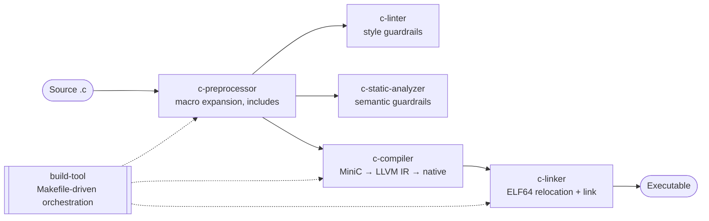
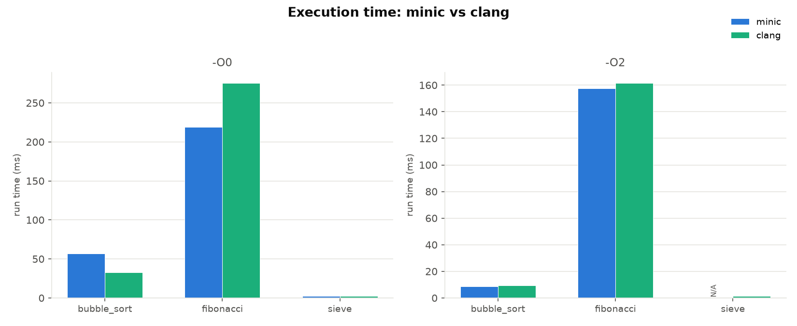
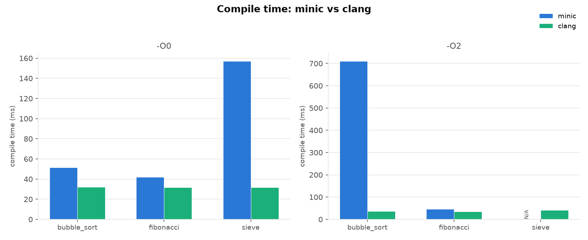

# llvm-c-compiler-toolchain

[](https://github.com/czhao-dev/llvm-c-compiler-toolchain/actions/workflows/testing-suite.yml)
[](https://github.com/czhao-dev/llvm-c-compiler-toolchain/actions/workflows/c-preprocessor.yml)
[](https://github.com/czhao-dev/llvm-c-compiler-toolchain/actions/workflows/c-linter.yml)
[](https://github.com/czhao-dev/llvm-c-compiler-toolchain/actions/workflows/c-static-analyzer.yml)
[](https://github.com/czhao-dev/llvm-c-compiler-toolchain/actions/workflows/c-compiler.yml)
[](https://github.com/czhao-dev/llvm-c-compiler-toolchain/actions/workflows/c-linker.yml)
[](https://github.com/czhao-dev/llvm-c-compiler-toolchain/actions/workflows/build-tool.yml)
[](LICENSE)

A small C toolchain built from scratch, one piece at a time: a preprocessor, a style linter, a static analyzer, a compiler, a linker, and a build tool.

Each subproject is independent and self-contained — its own language, build system, tests, and README — but together they cover the path from source code to a finished build: check the code, compile it, build it.

---

## Architecture

Source flows left to right through the pipeline; `c-linter` and
`c-static-analyzer` are guardrails that run on the same preprocessed
source rather than gating it, and `build-tool` is the Makefile-driven
orchestration layer that can wire any of these stages into recipes:



## Projects

Listed in logical pipeline order — preprocess, then the two source-level
guardrails, then compile and link, with `build-tool` last since it
orchestrates the others rather than sitting in the linear flow:

| Project | Language | Description |
|---|---|---|
| [c-preprocessor](c-preprocessor/README.md) | C++20 | A minimal C preprocessor: `#include` file inclusion, object-like `#define`/`#undef` macros with hide-set-safe recursive expansion, and `//`/`/* */` comment stripping. Function-like macros, conditional compilation, and `##`/`#` are explicit non-goals — each is a hard error rather than a silent no-op. |
| [c-linter](c-linter/README.md) | C++20 | A style/formatting linter for C: snake_case naming, line length (80 cols) and trailing whitespace, magic-number detection in comparisons, and K&R/Allman brace-style consistency. Reporting only — no auto-fixing, and no semantic checks (that's c-static-analyzer's job). |
| [c-static-analyzer](c-static-analyzer/README.md) | C++20 | A lightweight static analyzer for C code. Parses `.c`/`.h` files with tree-sitter (no compilation needed) and reports diagnostics for complexity, unused variables, nesting depth, missing returns, unreachable code, and (new) use of an uninitialized variable. |
| [c-compiler](c-compiler/README.md) | C++20 / LLVM | **MiniC** — a compiler for a statically-typed subset of C. Hand-written lexer, recursive-descent parser, semantic analyzer, and LLVM IR codegen producing native binaries, cross-validated against clang. |
| [c-linker](c-linker/README.md) | C++20 | A static linker for real ELF64 x86-64 object files: merges `.text`/`.data` sections across multiple `.o` files, resolves symbols (undefined-symbol and multiple-definition detection), applies `Abs64`/`Pc32` relocation fixups, and writes a real, runnable static ELF executable. No dynamic linking, archive parsing, or LTO. |
| [build-tool](build-tool/README.md) | C++20 | A dependency-graph-aware build tool implementing core GNU Make semantics. Resolves a Makefile into a topologically-ordered plan, checks mtime-based staleness, and executes recipes serially with cycle detection and `-k`/`--keep-going` support. |

## Highlights

**c-preprocessor** — A four-stage pipeline (comment stripper → directive/include line-driver → tokenizer → hide-set-based macro rescanner) built on `libpp_core`, with zero external dependencies. `#include` resolves double-quoted paths relative to the *including* file's directory, then against `-I` search directories in order; circular includes are detected and reported with the full chain, while diamond includes are intentionally left un-deduplicated, since there are no include guards. Recursive macro expansion (a macro's replacement can reference another macro, e.g. `TWO_PI` → `PI * 2` → `3 * 2`) terminates correctly on self-referential and mutually recursive definitions via the standard "blue paint" hide-set algorithm — every token produced by expanding macro `M` carries `M` in its hide set, so an identifier already in its own hide set is emitted literally instead of looping forever, matching real `cpp` behavior on inputs like `#define X X + 1` rather than erroring out. Redefining a macro is last-wins with no diagnostic, a deliberate simplification versus strict C's identical-redefinition requirement, and `#undef` gets correct late-binding for free since macro bodies are stored as raw, unexpanded tokens. Comment stripping replaces a multi-line block comment with the same number of newlines it contained, so line numbers in diagnostics stay accurate straight through it. Function-like macros, conditional compilation (`#ifdef`/`#if`), and `##`/`#` are explicit non-goals — each is a hard `file:line` compile error rather than a silent no-op, and the CLI's own exit codes (`0` success, `1` preprocessing/I/O error, `2` usage error) follow the same convention as every other tool in this toolchain. All 7 test suites pass, including a byte-for-byte golden-output comparison against a multi-file example and a subprocess-level exercise of the CLI.

**c-linter** — Five rules (`CL001`–`CL005`) covering snake_case naming, line length (80 cols default), trailing whitespace, magic numbers in comparisons, and K&R/Allman brace-style consistency, built on a small hand-written lexer that's deliberately never shared with `c-compiler`, keeping the subproject independent per this repo's convention. The lexer is tolerant by design — unterminated comments/literals and unmodeled punctuation fall through to a generic token type rather than erroring, since a linter has to process real-world, possibly-broken C it doesn't fully model — and keyword recognition is deliberately minimal too: only `if`/`while` are distinct tokens, every other keyword lexes as a plain identifier, which is safe because every real C keyword is lowercase with no embedded uppercase, so CL001 can never misfire on one. Naming (CL001) is a pure token-level check with no symbol table, so every *occurrence* of a badly-named identifier is flagged, not just its declaration; magic-number detection (CL004) exempts `0`, `1`, and `-1` as common sentinel values and only looks forward from the comparison operator, not backward; brace-style checking (CL005) matches the closing parenthesis of an `if`/`while` condition through nested parens against the placement of the following brace. Line length and trailing whitespace run as a raw-text pass before tokenization even happens. All 8 test suites pass. Reporting only — no auto-fixing, no indentation tracking, and no semantic checks (that boundary belongs to `c-static-analyzer`) — with CI-friendly exit codes (`0`/`1`/`2`).

**c-static-analyzer** — Six rules (`SA001`–`SA006`) covering cyclomatic complexity, unused variables, control-flow nesting depth, non-exhaustive return paths, unreachable code after `return`/`break`/`continue`/`goto`, and (new) a textual, non-dataflow check for a local read before it's ever written, built directly against tree-sitter's C API and the `tree-sitter-c` grammar (fetched via CMake `FetchContent` and compiled as plain C static libraries, deliberately bypassing the grammar's own bundled build in favor of compiling its pre-generated `parser.c` directly — the only subproject with an external dependency). File discovery skips common non-project directories (`.git`, `build`, `dist`, `vendor`, `third_party`, ...) by default, and behavior is configurable via CLI flags or a discovered `.c-static-analyzer.toml` (rule selection, complexity/nesting thresholds, exclude globs), with CLI flags always taking precedence over the file. Config discovery walks upward from the scan's working directory through ancestor directories and the nearest file found wins, even one that fails to parse (defaults apply rather than searching further up); an unreadable input file yields a synthetic, unregistered `SA000` diagnostic instead of aborting the whole scan. Adding a new rule is a two-file change (a header implementing the `Rule` interface plus one registration line), by design. 12 test suites pass, including a byte-for-byte golden-output comparison against a fixture engineered to trigger every rule at once, plus a subprocess CLI test asserting the exit-code contract (`0` clean, `1` findings, `2` usage error).

**MiniC compiler (c-compiler)** — A complete four-stage pipeline (lexer → recursive-descent parser → semantic analyzer → LLVM IR generator) compiled into `libminic_core.a` behind a thin CLI, with `--emit-tokens`/`--emit-ast`/`--emit-ir` flags exposing every stage's output for inspection. The language subset covers `int`/`float`/`char`/`void`, pointers (including address-of/dereference and null-pointer comparisons), fixed-size arrays with pointer decay, named structs/unions/enums with first-class whole-value assignment, the full arithmetic/comparison/logical/bitwise/ternary/compound-assignment operator set, and `if`/`while`/`for`/`do`-`while`/`switch`-with-real-fallthrough/`goto`/labels — recursive functions work because the IR generator resolves forward references correctly. The semantic analyzer catches undeclared identifiers, type mismatches, wrong argument counts, and return-type mismatches with precise `file:line:col` diagnostics (a single-line `file:line:col: error: message` format — no source-snippet or caret rendering; that's opt-in via `--show-source` on `c-lint`/`c-static-analyzer` instead, see [Testing & Performance](#testing--performance)). All five test suites pass, and all nine example programs (fibonacci, fizzbuzz, gcd, pointer swap, array sum, struct point, bit ops, control flow, sum of squares) produce byte-for-byte identical output to `clang` compiling the same source. A targeted correctness review found and fixed four real bugs — misordered assignment diagnostics, a temp-file leak on write failure, missing float-exponent lexing (`1e5`), and a sema/codegen type disagreement on unary negation of `char` — each verified with a regression case. `-O1`/`-O2`/`-O3` run LLVM's real new-pass-manager pipeline (`mem2reg`, `instcombine`, `simplifycfg`, `tailcallelim`, loop unrolling); `-O2` gets `fibonacci(40)` to a measured 1.4× speedup over `-O0` and converts its tail recursion into a loop. The language coverage itself grew through five dependency-ordered tiers — pointers, then arrays (which decay from pointers), then structs/unions/enums (reusing the pointer/GEP machinery), then the extended operator set, then the remaining control-flow forms — each landing with its own tests and example program; casts/`sizeof`, storage qualifiers (`const`/`static`/`extern`/`volatile`), and function prototypes/pointers/true variadics are staged next in `docs/ROADMAP.md`'s language-expansion plan.

**c-linker** — Parses real ELF64 x86-64 relocatable object files (`ET_REL`, the same output `clang -c` produces) via pointer-casting onto a small vendored subset of the ELF64 structures (macOS ships no `<elf.h>`, so this linker defines the handful of fields it actually reads/writes), rather than inventing a toy format. Of every section in an input file, only `.text`, `.data`, `.symtab`/`.strtab`, and `.rela.text`/`.rela.data` are read — everything else (`.rodata`, `.bss`, `.eh_frame`, `.debug_*`, ...) is looked up by name, not found, and silently dropped. The pipeline reads each object file, builds a global symbol table while flagging multiple-definition conflicts, checks every relocation's referenced symbol actually resolves somewhere, merges `.text` and `.data` sections across all input files in order with per-file alignment padding, patches `Abs64` (`write64(S+A)`) and `Pc32`/`Plt32` (`write32(S+A-P)`) relocation sites in place using the real x86-64 psABI formulas, and emits a real, minimal, loadable static ELF executable — two page-aligned `PT_LOAD` segments, no section headers required to run — directly executable on x86-64 Linux and verified independently with `readelf`. No dynamic linking (no PLT/GOT), archive (`.a`) parsing, link-time optimization, or `STB_WEAK` symbol support. Every diagnostic is `Severity::Error` — a static link either fully succeeds or fully fails, with no warning tier — while CLI usage errors (missing `-o`, no inputs, an unrecognized flag) are a separate path that always exits `2`, distinct from the linking-diagnostic exit code of `1`. All 6 test suites pass, every one exercising real `.o` files compiled on the fly by `clang --target=x86_64-unknown-linux-gnu` against freestanding fixtures rather than checked-in binary fixtures, including a relocation test that hand-verifies patch math against real compiled relocations and a fabricated out-of-range case that produces a clean `RelocationOverflow` error instead of corrupting bytes.

**build-tool** — Parses a Makefile into rules (explicit prerequisites, tab-indented recipes, `.PHONY` declarations before or after a rule, inline comments), resolves them into a dependency graph via a single recursive depth-first walk that both detects cycles and produces a valid topological order as a side effect (a node's prerequisites are always resolved before the node itself, so no separate scheduling pass is needed), skips up-to-date targets via mtime staleness, and runs outstanding recipes serially with fail-fast or `-k`/`--keep-going` semantics. Memoization guarantees a diamond-shaped shared prerequisite builds exactly once. `-j` parallelism is a deliberate non-goal: it only affects wall-clock build speed, not correctness, so this small tool trades it for a much simpler single-threaded executor with no thread pool or work-stealing queue. Variable expansion (`$(VAR)`, automatic variables), pattern rules (`%.o: %.c`), and built-in Make functions are likewise out of scope, alongside `include` directives, `ifdef`/`ifeq` conditionals, `VPATH`, order-only prerequisites (`|`), static pattern rules, double-colon rules, and target-specific variables — `-n` (dry run) and `-f` (Makefile path override) are recognized on the command line only so they can be rejected with a clear error rather than silently misread as a target name. This implements the core Make mental model (targets, prerequisites, recipes, staleness) precisely rather than a large surface approximately. 22 tests pass across three suites (Makefile parsing, dependency planning, and full binary end-to-end invocations covering a clean re-run and a touch-triggered rebuild), and it's the orchestration layer above the rest of the pipeline — a Makefile can wire any of the other five tools together as recipes.

## Documentation

Each subproject's own `docs/` directory is the normative reference for that stage of the pipeline — where the paragraphs above summarize, these documents specify exactly what is and isn't supported, including grammars, algorithms, and diagnostic formats:

| Project | Normative spec | Additional docs |
|---|---|---|
| [c-preprocessor](c-preprocessor/README.md) | [docs/SPEC.md](c-preprocessor/docs/SPEC.md) — directive grammar, hide-set macro semantics, `#include` resolution, CLI/error-format reference | — |
| [c-linter](c-linter/README.md) | [docs/SPEC.md](c-linter/docs/SPEC.md) — CL001–CL005 rule semantics, lexer tolerance policy, exemption rationale | — |
| [c-static-analyzer](c-static-analyzer/README.md) | [docs/SPEC.md](c-static-analyzer/docs/SPEC.md) — SA001–SA006 rule semantics, config-file discovery, glob-matching rules | — |
| [c-compiler](c-compiler/README.md) | [docs/language_spec.md](c-compiler/docs/language_spec.md) — full BNF grammar, type system, implicit-conversion table | [docs/ROADMAP.md](c-compiler/docs/ROADMAP.md) — staged language-expansion plan (tiers 1–8); [docs/ir_walkthrough.md](c-compiler/docs/ir_walkthrough.md) — annotated `-O0`/`-O2` LLVM IR for two example programs |
| [c-linker](c-linker/README.md) | [docs/SPEC.md](c-linker/docs/SPEC.md) — ELF64 section/symbol model, relocation patch formulas, diagnostic/exit-code table | — |
| [build-tool](build-tool/README.md) | [docs/SPEC.md](build-tool/docs/SPEC.md) — Makefile syntax subset, staleness/cycle/fail-fast semantics, explicit non-goals | — |

## Testing & Performance

Each subproject's own `tests/` stays unit/integration-scoped to that one
tool (see its README's Testing section). A separate top-level
[testing/](testing/README.md) directory holds suites that are
cross-cutting by nature and span several subprojects at once:

- **Differential testing** — compiles the same MiniC source with both
  `minic` and `clang`, runs both binaries, and diffs stdout + exit code
  byte-for-byte across operator precedence, control flow, pointers, and
  multi-function programs.
- **Negative/snapshot testing** — runs `c-lint` and `c-static-analyzer`
  against fixtures engineered to trigger their guardrails (a snake_case
  naming violation, a use-before-initialization read caught by the new
  `SA006` rule) and compares output against frozen golden fixtures.
- **Benchmarking** — [hyperfine](https://github.com/sharkdp/hyperfine)-driven
  compile-time and execution-time comparison between `minic` and `clang`
  across three algorithms (Sieve of Eratosthenes, recursive Fibonacci,
  worst-case bubble sort).
- **A stretch integration smoke test** — links a program using the
  repo's own `c-link`, with no clang anywhere in the link step.

Both `c-lint` and `c-static-analyzer` also gained a `--show-source` flag
(opt-in, default output unchanged) that prints the offending source line
and a caret under any diagnostic.

Run the suites locally, after building the relevant subprojects per
[Getting Started](#getting-started):

```bash
python3 testing/differential/run_differential_tests.py
python3 testing/invalid/run_negative_tests.py
python3 testing/benchmarks/run_benchmarks.py --output testing/benchmarks/results.json   # requires hyperfine
```

See [testing/README.md](testing/README.md) for the full breakdown,
including two real, pre-existing `c-compiler` bugs this exploration
surfaced and documented rather than fixed: an `-O2` codegen bug for any
function taking an `int **` parameter
([testing/differential/cases/03_pointers.mc](testing/differential/cases/03_pointers.mc)),
and a loop nested inside another loop that crashes at runtime past a
moderate iteration count and, separately, hangs indefinitely at `-O2`
compile time
([testing/benchmarks/programs/sieve.mc](testing/benchmarks/programs/sieve.mc)).

### Benchmark results




minic's **execution speed** is roughly at parity with clang across all
three programs at both `-O0` and `-O2` — expected, since `-O1`–`-O3` run
LLVM's real optimizer pipeline (see
[c-compiler](c-compiler/README.md)). **Compile speed** is
generally slower than clang on the machine these numbers were measured
on, not faster, most notably `bubble_sort -O2` at roughly 19×; these are
real measured numbers rather than a hand-typed marketing claim, since
the latter would just go stale. The missing `minic` bar at `sieve -O2`
is the compile-hang bug above, rendered as `N/A` rather than silently
dropped — `run_benchmarks.py` bounds every measurement with a timeout and
records that combination as a failure rather than hanging the whole
suite.

These charts are regenerated manually
(`python3 testing/benchmarks/plot.py testing/benchmarks/results.json`)
and committed alongside a normal code change, not auto-committed by CI;
for the latest numbers from a specific run, see the
[testing-suite workflow](https://github.com/czhao-dev/llvm-c-compiler-toolchain/actions/workflows/testing-suite.yml)'s
job summary and uploaded artifact.

## Getting Started

Each project builds independently — see its README for details.

```bash
# c-preprocessor (C++20/CMake, no external dependencies)
cd c-preprocessor && ./scripts/configure.sh && cmake --build build
ctest --test-dir build --output-on-failure

# c-linter (C++20/CMake, no external dependencies)
cd c-linter && ./scripts/configure.sh && cmake --build build
ctest --test-dir build --output-on-failure

# C static analyzer (C++20/CMake, fetches tree-sitter + tree-sitter-c via FetchContent)
cd c-static-analyzer && ./scripts/configure.sh && cmake --build build
ctest --test-dir build --output-on-failure

# MiniC compiler (C++20/CMake, requires LLVM 17+)
cd c-compiler && ./scripts/configure.sh && cmake --build build
ctest --test-dir build --output-on-failure

# c-linker (C++20/CMake, clang required on PATH to build test/example fixtures)
cd c-linker && ./scripts/configure.sh && cmake --build build
ctest --test-dir build --output-on-failure

# build-tool (C++20/CMake, no external dependencies)
cd build-tool && ./scripts/configure.sh && cmake --build build
ctest --test-dir build --output-on-failure
```

## References

Each subproject cites the sources specific to its own stage of the pipeline
in its own README — see
[c-preprocessor](c-preprocessor/README.md#references),
[c-linter](c-linter/README.md#references),
[c-static-analyzer](c-static-analyzer/README.md#references),
[c-compiler](c-compiler/README.md#references), and
[c-linker](c-linker/README.md#references). At the
toolchain level:

- ISO/IEC 9899:2018. *Programming Languages — C* (C17 standard) — the
  normative reference for the preprocessing, compilation, and
  translation-unit semantics these subprojects implement pieces of.
- Kernighan, Brian W. and Ritchie, Dennis M. *The C Programming Language*
  (2nd ed.). Prentice Hall, 1988. — the canonical description of the
  language this toolchain processes end to end.
- Aho, Lam, Sethi, Ullman. *Compilers: Principles, Techniques, and Tools*
  (2nd ed., "Dragon Book"). Addison-Wesley, 2006. — the standard reference
  for the overall shape of a toolchain pipeline: preprocess, compile,
  analyze, build.
- Levine, John R. *Linkers and Loaders*. Morgan Kaufmann, 2000. — the
  primary reference for `c-linker`, the final stage of this toolchain's
  pipeline: symbol resolution, section merging, and relocation processing.

## License

Each subproject is MIT licensed; see the `LICENSE` file in this directory and in each subproject.
